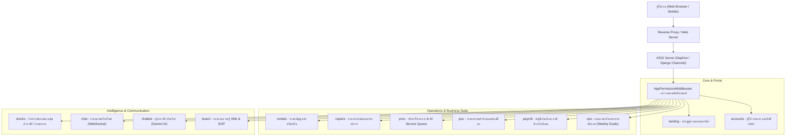

# 🏢 9Com Enterprise Platform (Contracts & Business Suite)

ระบบบริหารจัดการธุรกิจและปฏิบัติการแบบครบวงจร (Enterprise Resource & Operations Platform) พัฒนาด้วย **Django 5**, **Django Channels (WebSocket)**, และ **Google Gemini AI** ผสานการทำงานของระบบจัดการสัญญา, ซ่อมบำรุง, บริหารโครงการ, ขายหน้าร้าน, บัญชีเงินเดือน, วิเคราะห์หุ้นด้วย AI, ตลอดจนระบบสื่อสารและคลังความรู้ภายในองค์กร

---

## 📌 ภาพรวมสถาปัตยกรรมระบบ (System Architecture)



---

## 🚀 สรุปรายการแอปพลิเคชันทั้งหมดในโปรเจกต์

| ลำดับ | ชื่อแอป (App) | เส้นทาง (URL Prefix) | สิทธิ์เข้าถึง (Permission Flag) | หน้าที่หลัก |
| :---: | :--- | :--- | :--- | :--- |
| 1 | **[landing](file:///d:/DjangoProjects/contracts/landing/README.md)** | `/` | ทุกคนที่ล็อกอิน | พอร์ทัลกลาง รวบรวมทางเข้าสู่โมดูลทั้งหมดตามสิทธิ์ของผู้ใช้ |
| 2 | **[accounts](file:///d:/DjangoProjects/contracts/accounts/README.md)** | `/accounts/` | `access_accounts` | จัดการผู้ใช้ โปรไฟล์ บทบาท (Roles) และกำหนดสิทธิ์รายบุคคล |
| 3 | **[rentals](file:///d:/DjangoProjects/contracts/rentals/README.md)** | `/contracts/` | `access_rentals` | จัดการทรัพย์สิน/เครื่องจักรให้เช่า ผู้เช่า และสัญญาเช่า |
| 4 | **[repairs](file:///d:/DjangoProjects/contracts/repairs/README.md)** | `/repairs/` | `access_repairs` | รับงานซ่อม ติดตามสถานะ จ่ายงานช่าง และบันทึกส่งซ่อมภายนอก |
| 5 | **[pms](file:///d:/DjangoProjects/contracts/pms/README.md)** | `/pms/` | `access_pms` | บริหารโครงการ ลูกค้า CRM แผน SLA และคิวงานบริการอัตโนมัติ AI |
| 6 | **[pos](file:///d:/DjangoProjects/contracts/pos/README.md)** | `/pos/` | `access_pos` | ขายสินค้าหน้าร้าน บาร์โค้ด ใบเสร็จ คิดภาษี และตัดสต็อกสินค้า |
| 7 | **[payroll](file:///d:/DjangoProjects/contracts/payroll/README.md)** | `/payroll/` | `access_payroll` | รายงานผลงาน โครงสร้างเงินเดือน ภาษี ประกันสังคมขั้นบันได และสลิป |
| 8 | **[stocks](file:///d:/DjangoProjects/contracts/stocks/README.md)** | `/stocks/` | `access_stocks` | วิเคราะห์/สแกนหุ้นไทย-สหรัฐฯ ด้วยเทคนิคขั้นสูง บอทเทรด และพอร์ตจำลอง |
| 9 | **[chat](file:///d:/DjangoProjects/contracts/chat/README.md)** | `/chat/` | `access_chat` | ระบบแชทสดเรียลไทม์ ห้องแยกตามระบบ/โครงการ และแชร์พิกัดช่าง |
| 10 | **[chatbot](file:///d:/DjangoProjects/contracts/chatbot/README.md)** | `/chatbot/` | ทุกคนที่ได้รับอนุญาต | ผู้ช่วยตอบคำถามอัจฉริยะผ่าน Google Gemini AI |
| 11 | **[ops](file:///d:/DjangoProjects/contracts/ops/README.md)** | `/ops/` | `access_ops` | จัดการเป้าหมายรายสัปดาห์ (Weekly Goals) และติดตามความคืบหน้ารายวัน |
| 12 | **[board](file:///d:/DjangoProjects/contracts/board/README.md)** | `/board/` | `access_board` | ศูนย์รวมความรู้องค์กร Technical Wiki, SOP, FAQ และประกาศภายใน |

---

## 🛠️ รายละเอียดของแต่ละแอปพลิเคชัน (App Details)

### 1. 🏠 Landing App (`landing/`)
* **จุดประสงค์**: ประตูบานแรกของระบบ (Portal Homepage)
* **คุณสมบัติเด่น**:
  * แสดงแดชบอร์ดทางเข้าของแต่ละระบบตามสิทธิ์ที่ผู้ใช้ได้รับ (Role-Based Visibility)
  * แสดงข้อมูลสถานะผู้ใช้งาน ข้อมูลโปรไฟล์ และปุ่มลัดไปยังระบบงานหลัก
* **ไฟล์สำคัญ**: [views.py](file:///d:/DjangoProjects/contracts/landing/views.py), [urls.py](file:///d:/DjangoProjects/contracts/landing/urls.py)

---

### 2. 👤 Accounts App (`accounts/`)
* **จุดประสงค์**: บริหารจัดการข้อมูลผู้ใช้งาน บทบาทหน้าที่ และควบคุมสิทธิ์การเข้าถึง (RBAC)
* **คุณสมบัติเด่น**:
  * **Role Model**: จัดการบทบาทได้แบบไดนามิก เช่น Admin, Manager, Reception, Technician Lead, Technician, Sale, HR
  * **UserProfile**: ผูกสิทธิ์รายโมดูล (`access_rentals`, `access_repairs`, `access_pos`, `access_pms`, `access_payroll`, `access_stocks`, `access_chat`, `access_ops`, `access_board`)
  * ตรวจสอบสิทธิ์ผ่าน `AppPermissionMiddleware` ในระดับ URL Prefix
* **ไฟล์สำคัญ**: [models.py](file:///d:/DjangoProjects/contracts/accounts/models.py), [views.py](file:///d:/DjangoProjects/contracts/accounts/views.py)

---

### 3. 📜 Rentals App (`rentals/` - URL: `/contracts/`)
* **จุดประสงค์**: ระบบบริหารจัดการสัญญาเช่าทรัพย์สินและอุปกรณ์
* **คุณสมบัติเด่น**:
  * **Asset**: บันทึกทรัพย์สิน/เครื่องจักร รหัสซีเรียล อัตราค่าเช่ารายเดือน และสถานะ (Available, Maintenance, Rented)
  * **Tenant**: บันทึกข้อมูลผู้เช่าทั้งบุคคลธรรมดาและนิติบุคคล เลขบัตร/พาสปอร์ต และข้อมูลติดต่อ
  * **Contract**: จัดทำสัญญาเช่า วันที่เริ่ม-สิ้นสุด วงเงินมัดจำ อัตราค่าเช่า และสถานะสัญญา (Active, Expired, Terminated)
* **ไฟล์สำคัญ**: [models.py](file:///d:/DjangoProjects/contracts/rentals/models.py), [views.py](file:///d:/DjangoProjects/contracts/rentals/views.py)

---

### 4. 🔧 Repairs App (`repairs/`)
* **จุดประสงค์**: ระบบรับแจ้งซ่อม จัดการงานช่าง และติดตามประวัติอุปกรณ์
* **คุณสมบัติเด่น**:
  * **Customer & Device**: บันทึกข้อมูลลูกค้า (รหัสลูกค้าอัตโนมัติ `CYYYYMMDDxxx`), ข้อมูลเครื่อง ซีเรียล ยี่ห้อ และประเภทอุปกรณ์
  * **RepairJob & RepairItem**: ใบรับซ่อมและรายการซ่อม รองรับ Workflow สถานะครบวงจร (Pending, Diagnosing, Waiting Parts, Repairing, Testing, Ready, Delivered)
  * **Technician & OutsourceLog**: มอบหมายงานให้ช่างภายใน หรือส่งซ่อมศูนย์ภายนอกพร้อมบันทึกประวัติการเปลี่ยนสถานะ
* **ไฟล์สำคัญ**: [models.py](file:///d:/DjangoProjects/contracts/repairs/models.py), [views.py](file:///d:/DjangoProjects/contracts/repairs/views.py)

---

### 5. 📊 PMS App (`pms/`)
* **จุดประสงค์**: ระบบบริหารโครงการและงานบริการ (Project Management System)
* **คุณสมบัติเด่น**:
  * **Customer CRM & SLA**: จัดกลุ่มลูกค้า (Segment) และผูกแผน SLA กำหนดเวลาตอบกลับและเวลาปิดงาน
  * **Project Lifecycle**: จัดการโครงการ รายการสินค้า/บริการ งบประมาณ และสถานะงานแบบ Dynamic (`JobStatus`)
  * **AI Service Queue**: ระบบคิวงานอัจฉริยะ แนะนำและจัดสรรทีมช่างด้วย Google Gemini AI ร่วมกับการคำนวณระยะทาง GPS และทักษะ
* **ไฟล์สำคัญ**: [models.py](file:///d:/DjangoProjects/contracts/pms/models.py), [views.py](file:///d:/DjangoProjects/contracts/pms/views.py)

---

### 6. 🛒 POS App (`pos/`)
* **จุดประสงค์**: ระบบขายหน้าร้าน (Point of Sale) และตัดสต็อกสินค้า
* **คุณสมบัติเด่น**:
  * **Product & Category**: จัดการหมวดหมู่สินค้า รหัสสินค้า/บาร์โค้ด ราคา สต็อก และรูปภาพสินค้า
  * **Order & OrderItem**: ระบบคิดเงิน บันทึกรายการขาย คำนวณภาษีมูลค่าเพิ่ม ส่วนลด ยอดเงินรับ-เงินทอน
  * **Stock Deduction**: ตัดยอดสินค้าคงคลังทันทีที่มีการเปิดบิลขาย
* **ไฟล์สำคัญ**: [models.py](file:///d:/DjangoProjects/contracts/pos/models.py), [views.py](file:///d:/DjangoProjects/contracts/pos/views.py)

---

### 7. 💵 Payroll App (`payroll/`)
* **จุดประสงค์**: ระบบคำนวณเงินเดือน บันทึกเวลาทำงาน และพิมพ์สลิปเงินเดือน
* **คุณสมบัติเด่น**:
  * **WorkReport**: รายงานผลงานประจำเดือน ขาด ลา มาสาย ค่าล่วงเวลา (OT) และโบนัส
  * **EmployeeSalaryConfig**: กำหนดฐานเงินเดือน เบี้ยขยัน ค่าครองชีพ ค่าวิชาชีพของพนักงานแต่ละคน
  * **SSOBracket**: ระบบคำนวณประกันสังคมแบบขั้นบันได ปรับเปลี่ยนอัตราและเพดานได้เอง
  * **PayrollRecord**: คำนวณยอดสุทธิ (Net Pay), ภาษีหัก ณ ที่จ่าย, ประกันสังคม พร้อม Workflow การอนุมัติ (Draft -> Submitted -> Approved/Rejected)
* **ไฟล์สำคัญ**: [models.py](file:///d:/DjangoProjects/contracts/payroll/models.py), [views.py](file:///d:/DjangoProjects/contracts/payroll/views.py)

---

### 8. 📈 Stocks App (`stocks/`)
* **จุดประสงค์**: แพลตฟอร์มวิเคราะห์ สแกนหุ้น และจำลองการเทรดอัจฉริยะ (SET & US Markets)
* **คุณสมบัติเด่น**:
  * **Precision Momentum Scanner**: สแกนหุ้นคุณภาพสูงด้วย Minervini Trend Template, RS Rating, VCP, Wyckoff, Pocket Pivot, Stage 2, S&D Zone
  * **Trading Bots**: บอทเทรดอัตโนมัติจำลองกลยุทธ์ (EMA Cross, RSI/MACD, SEPA, Precision Bot)
  * **Portfolio & Risk Management**: คำนวณ Trailing Stop อัตโนมัติ, Pyramid Alerts, Win Probability
  * **Gemini AI Analysis**: สรุปบทวิเคราะห์ทางเทคนิคและหน้าเทรดด้วย Google Gemini AI
* **ไฟล์สำคัญ**: [models.py](file:///d:/DjangoProjects/contracts/stocks/models.py), [views/scanners.py](file:///d:/DjangoProjects/contracts/stocks/views/scanners.py)

---

### 9. 💬 Chat App (`chat/`)
* **จุดประสงค์**: ศูนย์แชทเรียลไทม์ภายในองค์กร (Real-Time Enterprise Messaging)
* **คุณสมบัติเด่น**:
  * พัฒนาบน **Django Channels** และ **WebSocket** สำหรับการส่งข้อความทันที
  * ห้องแชทกลาง ห้องตามระบบงาน (General, Rentals, Repairs, PMS, Payroll, Stocks) และห้องเฉพาะโครงการ
  * ระบบห้องส่วนตัว (Private Room Access Control)
  * รองรับการแชร์พิกัด GPS สำหรับทีมช่างหน้างาน
* **ไฟล์สำคัญ**: [models.py](file:///d:/DjangoProjects/contracts/chat/models.py), [consumers.py](file:///d:/DjangoProjects/contracts/chat/consumers.py)

---

### 10. 🤖 Chatbot App (`chatbot/`)
* **จุดประสงค์**: ผู้ช่วย AI อัจฉริยะ (9Com Intelligence Assistant)
* **คุณสมบัติเด่น**:
  * เชื่อมต่อ Google Gemini API ให้บริการถามตอบข้อมูล ให้คำแนะนำการใช้งาน และช่วยเหลือผู้ใช้งาน
  * ระบบ Sync ข้อมูลโปรไฟล์ผู้ใช้งานเพื่อสร้างบริบทในการตอบคำถาม
* **ไฟล์สำคัญ**: [views.py](file:///d:/DjangoProjects/contracts/chatbot/views.py), `services/gemini.py`

---

### 11. 🎯 Ops App (`ops/`)
* **จุดประสงค์**: ระบบบริหารจัดการแผนงานและเป้าหมายการปฏิบัติงาน (Operations Management)
* **คุณสมบัติเด่น**:
  * **Department & Employee**: โครงสร้างฝ่ายงานและบุคลากร
  * **WeeklyGoal**: กำหนดเป้าหมายรายสัปดาห์ (จันทร์-เสาร์) พร้อมตัวเลข Target, Action Plan และความเสี่ยงที่คาดการณ์
  * **DailyProgress**: บันทึกความคืบหน้ารายวัน คำนวณ % ความสำเร็จและแสดงสถานะสีแบบอัตโนมัติ
* **ไฟล์สำคัญ**: [models.py](file:///d:/DjangoProjects/contracts/ops/models.py), [views.py](file:///d:/DjangoProjects/contracts/ops/views.py)

---

### 12. 📚 Board App (`board/`)
* **จุดประสงค์**: กระดานแลกเปลี่ยนความรู้และคู่มือปฏิบัติงาน (Knowledge Board & Wiki)
* **คุณสมบัติเด่น**:
  * แบ่งหมวดหมู่ (Category) และป้ายกำกับ (Tags) ชัดเจน
  * รองรับเนื้อหาหลายรูปแบบ: Technical Wiki, SOP (ระเบียบปฏิบัติ), FAQ, บทเรียนที่ได้รับ (Lesson Learned), และประกาศบริษัท
  * ระบบค้นหาและแนบไฟล์ประกอบ
* **ไฟล์สำคัญ**: [models.py](file:///d:/DjangoProjects/contracts/board/models.py), [views.py](file:///d:/DjangoProjects/contracts/board/views.py)

---

## 💻 เทคโนโลยีที่ใช้งาน (Tech Stack)

* **Backend**: Python 3.11+, Django 5.x, Django Channels
* **ASGI Server**: Daphne
* **Database**: SQLite (Development) / PostgreSQL (Production)
* **Cache & Async**: Django Cache Framework, Python Threading, ThreadPoolExecutor
* **Market Data & Technicals**: `yfinance`, `yahooquery`, `pandas`, `pandas_ta`, `numpy`
* **AI & Machine Learning**: Google Gemini API (`google-genai` / `google-generativeai`)
* **Frontend**: HTML5, Vanilla CSS, Tailwind CSS / Bootstrap, JavaScript (ES6+), WebSocket

---

## ⚙️ วิธีการติดตั้งและรันระบบ (Setup & Installation)

1. **Clone Repository และติดตั้ง Dependencies**:
   ```bash
   git clone <repository_url>
   cd contracts
   python -m venv .venv
   # Windows:
   .venv\Scripts\activate
   # Linux/macOS:
   source .venv/bin/activate
   pip install -r requirements.txt
   ```

2. **ตั้งค่าตัวแปรสภาพแวดล้อม (.env)**:
   สร้างไฟล์ `.env` ที่ root directory:
   ```env
   DJANGO_DEBUG=True
   SECRET_KEY=your-secret-key-here
   GEMINI_API_KEY=your-gemini-api-key
   ```

3. **รัน Migration และสร้าง Superuser**:
   ```bash
   python manage.py migrate
   python manage.py createsuperuser
   ```

4. **รันเซิร์ฟเวอร์ (ASGI Support สำหรับ Channels)**:
   ```bash
   # แบบมาตรฐานด้วย Daphne หรือ runserver
   python manage.py runserver 0.0.0.0:8000
   ```
   เข้าใช้งานระบบผ่านเว็บเบราว์เซอร์ที่: `http://localhost:8000`
