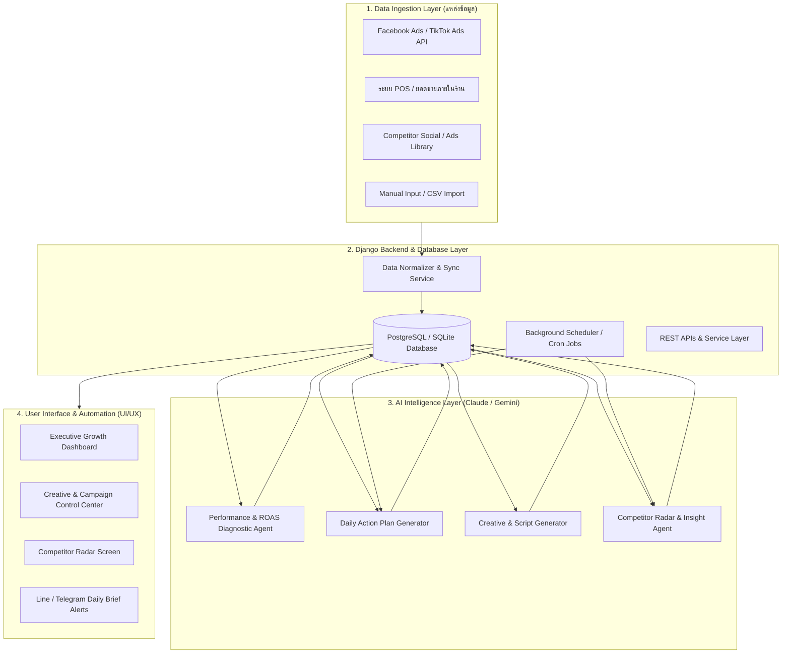
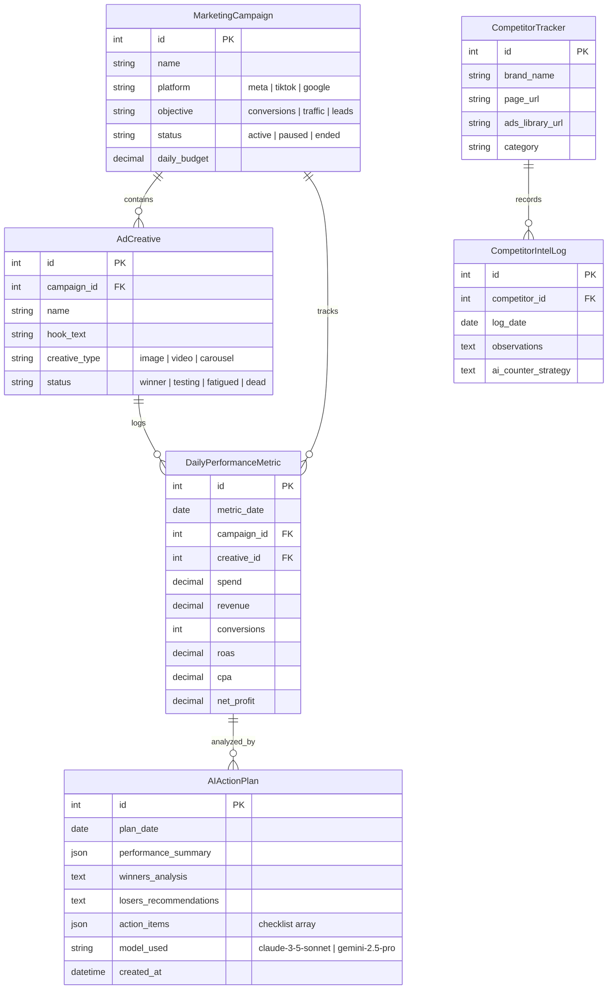

# 🚀 เอกสารการออกแบบสถาปัตยกรรมระบบ AI Marketing & Growth OS
## (Autonomous Business & Marketing Intelligence Operating System)

> **แนวคิดหลักตามวิดีโอ:** *"ธุรกิจโตขึ้น ไม่ได้แปลว่าต้องจ้างคนเพิ่ม"*  
> ระบบนี้ถูกออกแบบมาเพื่อทำหน้าที่แทนทีม Marketing & Operations (Media Buyer, Data Analyst, Creative Strategist, Copywriter, Competitor Researcher) โดยใช้ **AI Agents (Claude / Gemini)** ร่วมกับฐานข้อมูลและแดชบอร์ดควบคุมธุรกิจแบบครบวงจร

---

## 1. วัตถุประสงค์และขอบเขตของระบบ (Objectives & Scope)

### 1.1 วัตถุประสงค์ (Goals)
1. **ทดแทนงาน Routine ของทีมการตลาด:** ลดการใช้แรงงานคนในการรวบรวมตัวเลข, คำนวณ ROAS, คิดไอเดียคอนเทนต์, และสอดส่องคู่แข่ง
2. **ตัดสินใจด้วยข้อมูลแบบ Real-time (Data-Driven Decision):** รู้ตัวเลขจริง (ยอดขาย, ค่าแอด, กำไรสุทธิ) แบบรวมศูนย์ ไม่ต้องรอสรุปสิ้นเดือน
3. **AI Action Plan รายวัน:** แปลงตัวเลขที่ซับซ้อนให้กลายเป็น "สิ่งที่ต้องทำวันนี้" (Action Items) ทันที
4. **ขยายสเกลธุรกิจได้โดยไม่ต้องเพิ่ม Headcount:** ให้เจ้าของกิจการหรือทีมเล็กๆ 1-2 คน ดูแลธุรกิจขนาดใหญ่ได้อย่างมีประสิทธิภาพ

---

## 2. สถาปัตยกรรมระบบ (System Architecture)



---

## 3. องค์ประกอบหลัก 5 เสา (The 5 Core Modules)

### เสาหลักที่ 1: Performance & Profit Hub (ศูนย์รวมผลกำไรและต้นทุนโฆษณา)
* **การทำงาน:** 
  * รวบรวมข้อมูล Ad Spend (ค่าโฆษณาแยกตามช่องทาง: Meta, TikTok, Google)
  * ดึงยอดขายและต้นทุนสินค้า (COGS) จากระบบ POS หรือการกรอกยอดขาย
  * คำนวณดัชนีชี้วัดสำคัญแบบอัตโนมัติ:
    * **ROAS (Return on Ad Spend):** $\text{ROAS} = \frac{\text{ยอดขาย}}{\text{ค่าแอด}}$
    * **POAS (Profit on Ad Spend):** $\text{POAS} = \frac{\text{กำไรขั้นต้น}}{\text{ค่าแอด}}$
    * **MER (Marketing Efficiency Ratio / Blended ROAS):** $\text{MER} = \frac{\text{ยอดขายรวมทุกช่องทาง}}{\text{ค่าแอดรวมทั้งหมด}}$
    * **Net Profit (กำไรสุทธิหลังหักค่าแอดและต้นทุน):** $\text{Net Profit} = \text{Revenue} - \text{Ad Spend} - \text{COGS} - \text{OpEx}$

### เสาหลักที่ 2: AI Action Plan Generator (ระบบวินิจฉัยและวางแผนปฏิบัติการ)
* **การทำงาน:**
  * ทุกเช้าเวลา 08:00 น. หรือเมื่อผู้ใช้กดปุ่ม *"สร้าง Action Plan วันนี้"*
  * AI อ่านข้อมูลสถิติของทุกแคมเปญ/แอด แล้วจัดกลุ่มตามสถานะ:
    * 🟢 **Winners (ตัวทำเงิน):** ROAS สูง ต้นทุนต่ำ $\rightarrow$ แนะนำให้เพิ่มงบ (Scale Budget) 15-20%
    * 🟡 **Fatigued (แอดเริ่มล้า):** ความถี่ (Frequency) สูงขึ้น CTR ตกลง $\rightarrow$ แนะนำให้ทำ Creative ตัวใหม่มาเปลี่ยน
    * 🔴 **Bleeders / Losers (ตัวดูดเงิน):** ใช้เงินเกินเกณฑ์แต่ไม่มียอดขาย $\rightarrow$ แนะนำให้ปิด (Kill) ทันที
  * สร้าง Checklists สรุป 3-5 ข้อที่ต้องทำทันทีในวันนี้

### เสาหลักที่ 3: Creative & Copywriting Engine (ระบบคิดและร่างคอนเทนต์โฆษณา)
* **การทำงาน:**
  * วิเคราะห์ว่า Angle ไหน หรือ Pain Point ไหนในอดีตที่ทำยอดขายได้ดี
  * AI สร้างชุดไอเดียสำหรับทดสอบใหม่:
    * **Hook Ideas (3 วินาทีแรก):** 5 รูปแบบที่ดึงดูดกลุ่มเป้าหมาย
    * **Video Script Template:** โครงสร้างสคริปต์วิดีโอ (Hook $\rightarrow$ Pain Point $\rightarrow$ Transformation $\rightarrow$ Solution $\rightarrow$ Offer $\rightarrow$ CTA)
    * **Caption Copywriting:** ข้อความโพสต์พร้อมแคปชั่นทั้งแบบยาว (Storytelling) และแบบสั้น (Direct Response)

### เสาหลักที่ 4: Competitor Radar & Market Intel (ระบบสอดส่องคู่แข่ง)
* **การทำงาน:**
  * เก็บรวบรวมข้อมูลความเคลื่อนไหวของคู่แข่ง (Page, Ads Library, สินค้าใหม่, โปรโมชั่น)
  * AI วิเคราะห์เปรียบเทียบ Positioning:
    * คู่แข่งกำลังเล่นจุดขายอะไร?
    * มีโปรโมชั่นหรือราคาแบบไหน?
    * ช่องว่างทางการตลาด (Market Gap) ที่เราสามารถชิงความได้เปรียบคืออะไร?
  * รายงานสรุปส่งเป็น Daily Market Digest

### เสาหลักที่ 5: Autonomous Alerts & Digest (ระบบรายงานและแจ้งเตือนอัตโนมัติ)
* **การทำงาน:**
  * ส่งข้อความสรุปสั้นกระชับผ่าน **Line Official Account / Line Notify / Telegram Bot**
  * รูปแบบข้อความยามเช้า:
    > ☀️ **สรุปภาพรวมธุรกิจประจำวัน (DD/MM/YYYY)**  
    > 💰 ยอดขายเมื่อวาน: ฿125,400  
    > 📉 ค่าโฆษณารวม: ฿28,500 (ROAS: 4.40x)  
    > 💵 กำไรสุทธิ: ฿54,200 (Margin: 43.2%)  
    > 🎯 **3 สิ่งที่ AI แนะนำให้ทำวันนี้:**  
    > 1. เพิ่มงบแคมเปญ 'Serum-01' อีก 20%  
    > 2. ปิดแอด 'Video-Hook-B' ทันที (ROAS 0.9x ขาดทุน)  
    > 3. เตรียมอัดคลิปทดสอบ Hook เรื่อง "นอนดึกหน้าโทรม" ตามคู่แข่งเจ้า A

---

## 4. โครงสร้างฐานข้อมูล (Database Schema)



---

## 5. การออกแบบ Prompt และ AI Agent Workflow

### 5.1 ระบบ Prompt สำหรับ AI Action Plan Generator
```markdown
System Prompt:
คุณคือ "Chief Growth Officer & Senior Performance Marketing AI" ระดับโลก
เป้าหมายของคุณคือวิเคราะห์ข้อมูลเมตริกการตลาดและยอดขายจริง เพื่อให้คำแนะนำที่ชัดเจน ตรงประเด็น และปฏิบัติได้ทันที (Actionable) 
โดยตัดทฤษฎีเวิ่นเว้อทิ้งทั้งหมด มุ่งเน้นการเพิ่ม "กำไรสุทธิ (Net Profit)" และ "ROAS" สูงสุด

Input Data Format:
- สถิติของแต่ละแคมเปญ/ครีเอทีฟ (Spend, Revenue, Conversions, ROAS, Benchmark Target)
- ยอดขายรวม และกำไรสุทธิของธุรกิจ

Output Structure (Strict JSON):
1. executive_summary: สรุปสั้นๆ 2 บรรทัดว่าสถานการณ์วันนี้ ดี/ทรง/แย่ เพราะอะไร
2. scale_list: รายการแอด/แคมเปญที่ควรเพิ่มงบ และจำนวนเงินที่แนะนำให้ปรับ
3. kill_list: รายการแอดที่ควรปิดทันที พร้อมเหตุผลตัวเลขรองรับ
4. creative_gap: วิเคราะห์ว่าทำไมตัวชนะถึงชนะ และควรทำชิ้นงานอะไรเพิ่ม
5. action_checklist: รายการงาน 3-5 ข้อเรียงตามลำดับความเร่งด่วน
```

---

## 6. หน้าจอผู้ใช้งาน (UI/UX Pages ตามวิดีโอ)

1. **หน้า 1: Executive Growth Overview (แดชบอร์ดภาพรวม)**
   - Top KPI Cards: ยอดขายรวม, ค่าแอด, ROAS, กำไรสุทธิ, อัตราส่วนกำไร (%)
   - Interactive Charts: กราฟเส้นเปรียบเทียบ Spend vs Revenue รายวัน
   - Profit Breakdown Waterfall: แผนภูมิการกระจายรายได้ $\rightarrow$ หักต้นทุนสินค้า $\rightarrow$ ค่าแอด $\rightarrow$ กำไรสุทธิ
2. **หน้า 2: Ad & Creative Matrix (ตารางตรวจสอบประสิทธิภาพรายชิ้น)**
   - แบ่งหมวดหมู่ชัดเจน: **[🚀 Winners] [⚡ Testing] [⚠️ Fatigued] [🛑 Kill]**
   - ปุ่ม Quick Action: สามารถกดอัปเดตสถานะหรือจดโน้ตได้ทันที
3. **หน้า 3: AI Daily Command Room (ห้องบัญชาการ AI)**
   - กล่องสรุป Action Plan ประจำวันพร้อม Checkbox ให้กดติ๊กเมื่อทำเสร็จ
   - ปุ่ม *"ขอคำแนะนำเพิ่มเติมจาก AI"* (Interactive Chat drawer)
4. **หน้า 4: Creative Lab (ห้องทดลองไอเดียโฆษณา)**
   - ตัวสร้าง Hook, Angles, และ Video Script โดยเลือกสไตล์ตามกลุ่มลูกค้า
5. **หน้า 5: Competitor Radar (ส่องคู่แข่ง)**
   - บันทึกและวิเคราะห์ความเคลื่อนไหวคู่แข่ง พร้อมข้อเสนอแนะเชิงกลยุทธ์แก้เกม

---

## 7. แผนการพัฒนาแบบเป็นขั้นเป็นตอน (Implementation Roadmap)

| เฟส (Phase) | รายละเอียดงาน | ผลลัพธ์ที่ได้ (Deliverables) |
| :--- | :--- | :--- |
| **Phase 1: Foundations & Models** | สร้างแอป `marketing`, ออกแบบ Database Models (Campaign, Metric, ActionPlan), หน้าบันทึกข้อมูล | ฐานข้อมูลพร้อม และสามารถบันทึกตัวเลขรายวันได้ |
| **Phase 2: Growth Dashboard UI** | พัฒนาหน้า Dashboard แสดงผล KPI Cards, กราฟ ROAS & Profit, คำนวณกำไรอัตโนมัติ | แดชบอร์ดสวยงาม พร้อมแสดงสถานะทางการเงิน |
| **Phase 3: AI Action Plan Engine** | เชื่อมต่อ Claude / Gemini API ส่งตัวเลขรายวันไปวิเคราะห์ แล้วแสดงผล Action Plan & Checklist | กดปุ่มแล้วได้แผนงานทันทีแบบในวิดีโอ |
| **Phase 4: Creative Lab & Copywriting** | สร้างระบบสร้าง Hook / Script / Angles สำหรับแอดและคอนเทนต์ | ระบบช่วยทีมทำคอนเทนต์โฆษณา |
| **Phase 5: Automated Alerts & Reporting** | ตั้ง Cron Task ประมวลผลยามเช้า และส่งสรุปเข้า Line / Telegram | ระบบทำงานอัตโนมัติ 100% โดยไม่ต้องเฝ้าหน้าจอ |

---
*เอกสารนี้จัดทำขึ้นเพื่อใช้เป็นพิมพ์เขียวมาตรฐาน (Standard Blueprint) สำหรับการพัฒนา AI Marketing OS ในโปรเจกต์ต่อไป*
